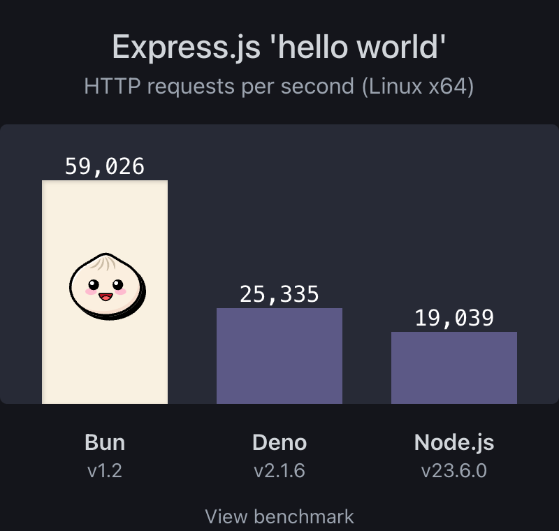
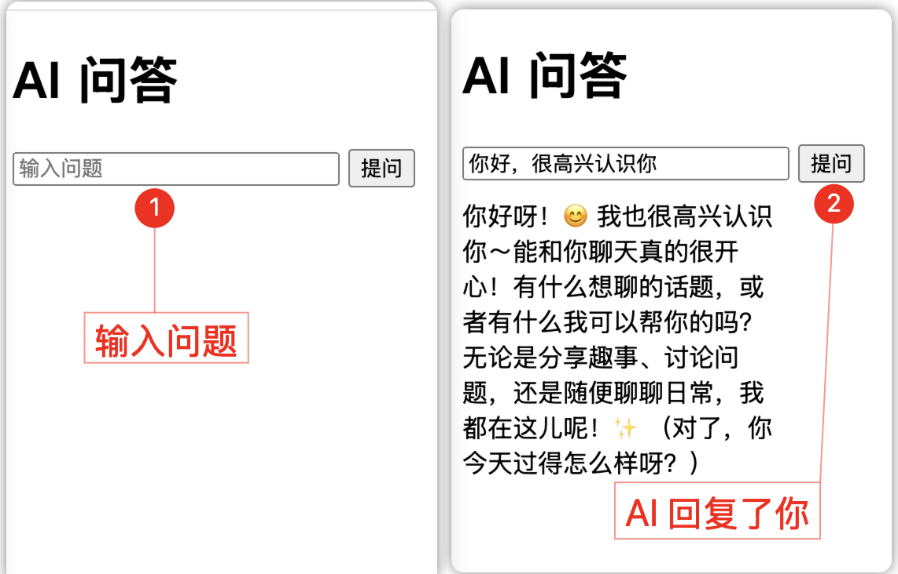

# 打开 AI 应用开发的大门

本系列共有十四篇文章，这是系列文章的第一篇《打开 AI 应用开发的大门》。在未来两周，我会把每篇内容都写得清清楚楚，助力大家轻松上手。后续文章同样干货满满，记得点赞、收藏，关注，让我们一起开启 AI 应用开发之旅！

为了通俗易懂，后续每一篇我都会尽可能详细说明。如果你已掌握部分知识，可按需阅读以提升效率；若想强化某一知识点，可在下方留言或在群里提问。当然，如今 AI 堪称最佳老师，一定要学会驾驭它，学会向他提问。

## 一、课程定位与学习路径

1.1 为什么选择 AI 应用开发？

你或许已经在前端开发的世界里摸爬滚打一段时间了，熟练掌握了 HTML、CSS 和 JavaScript 及 Vue 或 React 等技能，能搭建出一个个精美的网页。但你是否想过，为这些网页赋予 “智慧”，让它们能理解用户意图、自动响应用户需求？这就是 AI 应用开发的魅力所在。

打个比方，前端开发就像是建造房屋，你精心设计房屋的布局、装修，让它看起来美观又舒适。而 AI 应用开发则是为这所房屋装上 “智能大脑”，让它能实现智能照明、自动温控，甚至能根据你的生活习惯主动提供服务 ，从静态的界面交互迈向更具动态性和智能性的交互体验。

在当下大模型时代的浪潮中，AI 与 Web 的深度融合正源源不断地催生出大量全新的应用场景。例如，智能客服借助先进的自然语言处理技术，能够迅速理解用户问题并给出精准解答，极大地提升了客户服务的效率。又如，Manus 实现了 AI 从单纯解答问题到切实帮助用户解决问题的跨越，拓展了 AI 应用的边界。再如，个性化推荐系统通过精准分析用户行为数据，能够向用户推送其可能感兴趣的内容，有效增强了用户粘性。作为前端开发者，你在用户交互设计方面所具备的专业优势，能够与 AI 技术实现完美互补，为这些新兴场景注入独特的价值，从而在这一充满机遇的领域中开拓出属于自己的职业发展新路径 。

<div style="text-align: center;">
  
</div>

### 1.2 三位一体学习路径

为了帮助大家顺利从前端开发转型到 AI 应用开发，本系列课程采用 “理论 + 工具 + 实战” 三位一体的学习路径。

**理论部分**，我们不会陷入复杂的 AI 算法推导，而是聚焦于 AI 应用开发的核心逻辑。比如理解大模型如何接收输入、生成输出，以及如何利用这些能力构建应用。就像你不需要知道汽车发动机的每一个零件如何制造，但要明白如何驾驶汽车到达目的地一样，我们关注的是如何运用 AI 技术实现应用功能。

**工具方面**，将重点介绍 Bun.js、LangChain 等高效的开发工具链。Bun.js 作为新一代 JavaScript 运行时，能帮你避免很多历史包袱，具有出色的性能，能让你的开发效率大幅提升；LangChain 则是专门用于构建大模型应用的框架，它提供了丰富的工具和接口，帮助你轻松连接各种大模型，实现复杂的功能。掌握这些工具，就如同拥有了一套趁手的 “兵器”，能在开发中更加得心应手。

**实战环节**，会通过一个个实际案例，带你从需求分析开始，逐步完成设计、开发、测试，最终实现应用的部署上线。在这个过程中，你将遇到各种真实场景下的问题，并学会如何解决它们，积累宝贵的项目经验，真正掌握 AI 应用开发的技能 。

<div style="text-align: center;">
  
</div>

## 二、数学基础：AI 应用开发的基石

在 AI 应用开发中，数学就像是工匠手中的工具，没有它，再宏伟的建筑也只能是空中楼阁。虽然我们无需成为数学专家，但掌握一些核心的数学知识，是开启 AI 之旅大门的关键。接下来，让我们一起揭开线性代数和概率论这两大数学领域的神秘面纱，看看它们如何在 AI 世界里发挥作用。

### 2.1 线性代数：数据的「空间语言」

线性代数是 AI 领域中不可或缺的基础，它为我们提供了一种描述和处理数据的强大方式。简单来说，线性代数研究的是向量、矩阵和张量等数学对象，以及它们之间的运算和变换，就像学习一门新语言，掌握了这些基本元素，我们就能读懂 AI 背后的数据 “故事”。

**向量**

在日常生活中，就像去超市买东西列的小纸条，上面写的牛奶、面包、鸡蛋的数量，这个纸条就如同向量，每样东西的数量是向量的一个小部分。在人工智能领域，向量常用来表示一行行的数据，能把复杂的数据以一种结构化的方式呈现出来。

以网上购物为例，通过向量记录用户逛的次数、购买商品数量、收藏商品数量等信息，能够从这些数据中挖掘出用户的行为模式，进而了解用户的喜好。

基于对用户喜好的理解，商家和平台就可以给用户推荐更符合他们心意的商品，提升用户体验，增加商业效益 ，提高商品的销售转化率。

向量是人工智能算法处理数据的基础，机器学习和深度学习等人工智能技术依赖向量来表示和处理数据。通过将各种数据，如文本、图像、音频等转化为向量，模型能够对其进行分析、理解和学习。例如在图像识别中，图像被转化为向量后，模型可以通过对向量的计算和比较来识别物体。理解向量，才能更好地理解和运用机器学习、深度学习等人工智能技术，推动人工智能在各个领域的应用和发展。

<div style="text-align: center;">
  
</div>

**矩阵**

在很多场景中，数据并非孤立存在，而是具有多个维度和大量样本。以用户画像为例，每个用户都包含年龄、性别、地域、消费偏好等多个特征维度，涉及大量不同的用户个体。

如果只是用单个向量来表示数据，就无法全面且系统地呈现这些信息。而矩阵将不同用户的各类信息整合在一起，每一行代表一个用户，每一列代表一个特征维度，形成一个有行有列的表格结构。

通过对这个矩阵进行分析，能从整体上更全面地了解用户群体，精准定位目标用户，制定营销策略。比如电商平台依据用户画像矩阵，就能够向不同类型的用户推送符合他们兴趣的商品广告，实现精准营销，提高营销效果和资源利用效率，所以矩阵在数据处理和分析等方面具有重要意义和不可替代的作用 。

<div style="text-align: center;">
  
</div>

**张量**

你可以把张量想象成一个超级大的收纳盒，普通的矩阵就像是一个简单的小抽屉，只能在两个方向上放东西。但张量这个收纳盒可厉害了，它有好多好多方向可以放东西，就好比一个超级复杂的多层、多格的大柜子，每个小格子都能放不同的东西。就像玩的那种特别复杂的多层拼图，每一层每一块都有它的位置和作用，这就是张量，能在好多维度上存放和整理数据。

在人工智能里，很多时候我们要处理的东西可不是简单的一行一列的数据。比如说看视频，视频是由好多好多帧画面组成的，每一帧画面又包含了很多图像信息。如果只用简单的方式去处理，根本应付不来这么复杂的数据。张量就派上用场啦，它能把这些复杂的视频数据好好地 “收拾” 起来，让计算机可以对视频进行各种操作，像认出视频里演的是什么、追踪视频里某个物体怎么移动等等。

张量是矩阵的拓展形式，属于多维数组结构。在人工智能领域，对于处理如视频帧序列这类复杂的多维数据，张量发挥着关键作用。以视频为例，其整体可视为一个张量，每一帧对应一个包含图像信息的矩阵。通过对张量实施各类数学运算和深入分析，能够实现视频内容识别、目标跟踪等一系列人工智能应用功能 。

<div style="text-align: center;">
  
</div>

### 2.2 概率论：不确定性的量化工具

在现实世界中，充满了不确定性，而概率论就是我们用来量化和处理这种不确定性的有力工具。它研究的是随机事件发生的可能性，以及如何根据已有的数据进行推断和预测，在 AI 应用开发中，概率论帮助我们处理数据中的噪声和不确定性，做出更合理的决策。

**概率分布**

概率分布就像是一个 “可能性地图”，它清晰地描绘出随机变量各种可能取值所对应的概率情况。以抛硬币这个简单的例子来说，它就如同在一个只有两条岔路的路口，每次抛硬币的结果不是走向 “正面” 这条岔路，就是走向 “反面” 那条岔路，这便是典型的二项分布，正面朝上和反面朝上的概率均为 0.5 。在 AI 领域，二项分布就如同一个高效的分类助手，专门用来处理那些只有两种明确结果的事件，例如在邮件处理中，它能精准判断一封邮件到底是正常邮件还是垃圾邮件，帮助我们高效地管理邮件信息。

<div style="text-align: center;">
  
</div>

正态分布在生活里很常见，打个比方，就像大家排队比身高。大部分人的身高，都集中在队伍中间，和平均身高差不多，这就好比是正态分布的 “高峰”。而特别高或者特别矮的人，就像站在队伍两端的少数人，人数比较少。这样一来，把所有人的身高画成图，就会是一个漂亮的钟形曲线，中间高，两边低。

<div style="text-align: center;">
  
</div>

在图像识别领域，正态分布也很有用。就好像有个智能助手，它能研究图像里每个小色块（像素）的颜色数值。通过找到这些数值的分布规律，它就能把图像里那些杂乱无章的小干扰（噪声）去掉，让图像变得干干净净，这样计算机就能更清楚、准确地识别和分析图像。

**条件概率**

条件概率就像是玩猜谜游戏，当你已经知道了一些线索（某个条件发生），再去猜最终答案（另一个事件发生）的可能性。用符号 P (A|B) 来表示，这里 B 就是已知的线索，A 就是你要猜的答案，也就是在 B 事件发生的条件下，A 事件发生的概率。就好比，你知道今天下雨了（B 事件，即雨天），那猜测今天会不会堵车（A 事件，即堵车），这种情况下堵车的概率就可以用 P (堵车 | 雨天) 来表示。在现实生活中，了解这种概率能帮助我们提前做好应对，比如下雨天提前出门避免迟到。

<div style="text-align: center;">
  
</div>

在 AI 领域，条件概率主要解决分类和预测任务的问题。以语音识别为例，当我们已经识别出了前几个单词（这就是已知条件），要预测下一个单词是什么（预测的事件），这时候就用到了条件概率。从专业角度来说，在机器学习算法里，通过对大量数据中不同条件下各类事件发生频率的统计和分析，建立模型来计算条件概率。模型根据输入的已知条件特征，依据计算得到的条件概率，对未知事件进行分类判断或者预测其发生的可能性，以此实现智能化的任务处理 。

**贝叶斯定理**

想象一下，你来到水果摊购买橘子，老板告知你，这批橘子多数是甜的，仅有少数是酸的。这便是你对橘子味道的 “先验概率” 认知。随后，你剥开一个橘子品尝，发现它是甜的，这就如同获得了新的 “证据”。贝叶斯定理的作用，就是告诉你如何依据这个新证据，去修正之前对于橘子是甜还是酸的概率判断。

<div style="text-align: center;">
  
</div>

## 三、Bun.js 快速入门：高效开发的利器

在 AI 应用开发的技术海洋中，选择合适的开发工具至关重要。目前，Python 凭借丰富的库和强大的生态系统，依然是 AI 应用开发的最优选择，在数据处理、机器学习算法实现等方面有着无可比拟的优势。不过，对于前端开发者而言，使用 JavaScript 系的语言可能更容易接受并展开实验。Bun.js 作为一款新兴的 JavaScript 运行时，正逐渐崭露头角，为开发者抛弃历史包袱并带来了前所未有的高效开发体验。接下来，让我们一起简单的了解 Bun.js 。

### 3.1 为什么选择 Bun.js？

在前端开发的漫长演进历程中，JavaScript 运行时一直是开发者关注的核心。从最初的浏览器端脚本执行，到 Node.js 开启服务器端 JavaScript 开发的新时代，每一次技术的变革都推动着开发效率和应用性能的提升。如今，Bun.js 的出现，再次为 JavaScript 开发带来了新的突破，它凭借着卓越的性能和一体化的工具链，成为众多开发者眼中的 “香饽饽”。

**性能对比：Bun.js vs Node.js，速度提升 4 倍**

在开发 HTTP 服务器时，Bun.js 展现出了惊人的速度优势。通过性能测试发现，Bun.js 处理 HTTP 请求的速度比 Node.js 快 4 倍。这意味着在高并发的场景下，Bun.js 能够更快地响应用户请求，提供更流畅的用户体验。

想象一下，你经营着一家繁忙的线上商店，每天有成千上万的用户访问。如果你的服务器使用 Node.js，在购物高峰期可能会出现响应延迟，用户需要等待较长时间才能加载商品页面或完成下单操作，这很可能导致用户流失。而如果使用 Bun.js，它的高速响应能力能确保用户在瞬间就能得到服务，大大提升用户满意度和购物转化率 。

<div style="text-align: center;">
  
</div>

**一体化工具链：一站式解决开发难题**

Bun.js 集成了打包、测试、依赖管理等功能，为开发者提供了一体化的工具链。这意味着你不再需要像以往那样，在 Webpack、Jest 等多个工具之间进行繁琐的配置和切换，一切都可以在 Bun.js 中轻松完成。

就好比你要建造一座房子，以前需要分别寻找不同的工人来负责打地基、砌墙、装修等工作，协调起来非常麻烦。而现在，Bun.js 就像是一个全能的建筑团队，一个团队就能完成所有的工作，不仅高效，而且减少了沟通成本和出错的可能性 。

### 3.2 从前端到后端的无缝过渡

对于前端开发者来说，掌握 Bun.js 意味着能够更加轻松地实现从前端到后端的全栈开发。Bun.js 的语法和特性使得它在前后端开发中都能游刃有余，让你在一个统一的环境中完成整个应用的构建。

**基础语法：用 bun run 替代 npm run**

Bun.js 的基础语法非常简洁，易于上手。它提供了 bun run 命令，直接替代了 npm run，让你能更快速地运行 JavaScript 和 TypeScript 文件，以及 package.json 中的 scripts 脚本。而且，Bun.js 原生支持 TypeScript 和 JSX，无需额外的配置和转译步骤，你可以直接编写和运行 TypeScript/JSX 代码，就像在浏览器中使用 JavaScript 一样方便。

**实战示例：开发一个简易 Todo 应用**

接下来，我们通过一个实战示例，来看看如何使用 Bun.js 开发一个简易的 Todo 应用，展示它在路由、状态管理等核心功能方面的强大能力。

**创建项目**：首先，使用 bun init 命令初始化一个新的 Bun.js 项目，这会自动生成 package.json 文件和基本的项目结构 。

```bash
bun init my-todo-ai-app

cd my-todo-ai-app
```

**编写服务器代码**：在项目根目录下创建`server.js`文件，编写以下代码，实现 Todo 应用的基本路由和状态管理功能 。

```typescript
import { serve } from "bun";

// 模拟Todo数据
let todos = [
  { id: 1, text: "Learn Bun.js", completed: false },
  { id: 2, text: "Build a Todo App", completed: false },
];

serve({
  port: 3000,
  fetch(req) {
    return new Response(JSON.stringify(todos), {
      headers: { "Content-Type": "application/json" },
    });
  },
});
```

**运行应用**：使用`bun run server.js`命令启动服务器，然后在浏览器中访问`http://localhost:3000/todos`，就可以看到 Todo 列表。通过发送 HTTP 请求，还可以实现添加、更新和删除 Todo 的功能 。

```bash
bun run server.js
```

通过这个简单的示例，我们可以看到 Bun.js 在处理 HTTP 请求、状态管理和路由方面的简洁性和高效性。它让前端开发者能够快速地构建出功能完整的后端服务，实现从前端到后端的无缝过渡，为 AI 应用开发提供了坚实的基础 。

## 四、技术栈选型：Bun.js 与 LangChain 集成

### 4.1 为什么选择 LangChain？

在 AI 应用开发中，LangChain 就像是一把万能钥匙，为我们打开了通往各种复杂应用场景的大门。它是一个用于开发由语言模型驱动的应用程序的框架，通过提供一系列强大的工具和组件，让我们能够轻松地与大语言模型（LLM）进行交互，构建出功能丰富、智能高效的应用 。

**检索 - 增强 - 生成 (RAG)：**

检索 - 增强 - 生成（RAG）是 LangChain 的核心能力之一，它就像是煮一锅美味的砂锅粥。想象一下，你要煮一锅包含各种食材的砂锅粥，大米是基础（就像大模型本身的知识），但为了让粥更美味、更有营养，你还需要加入各种新鲜的食材，如蔬菜、肉类、海鲜等（这些就相当于从外部知识库中检索到的相关信息）。

<div style="text-align: center;">
  
</div>

在 RAG 模式中，当用户提出问题时，就好比你决定煮一锅粥。首先，LangChain 会从向量数据库等外部知识库中检索与问题相关的信息（就像挑选煮粥的食材），这些信息会作为补充内容与问题一起被输入到大模型中。大模型就像一位经验丰富的厨师，根据这些输入生成回答（就像厨师用食材煮出美味的粥） 。

通过这种方式，RAG 模式能够让大模型利用外部知识库中的最新信息，生成更准确、更丰富的回答，避免了大模型仅依赖自身预训练知识而可能出现的信息滞后或不准确的问题 。

**模块化设计：通过「检索 - 增强 - 生成」（RAG）模式，简化大模型交互流程**

LangChain 的模块化设计是其另一个突出优势。它将复杂的大模型应用开发过程分解为多个独立的模块，每个模块都有其特定的功能，就像搭积木一样，我们可以根据需求自由组合这些模块。

以 RAG 模式为例，它涉及到文档加载、文本分割、向量存储、信息检索和生成回答等多个步骤，每个步骤都对应着 LangChain 中的一个或多个模块。我们可以选择不同的文档加载器来处理各种格式的文件，如 PDF、Word、TXT 等；使用文本分割模块将文档分割成合适大小的片段，以便于后续处理；通过向量存储模块将文本片段转化为向量并存储在向量数据库中，实现高效的信息检索；最后，利用生成模块结合检索到的信息和大模型生成回答 。

这种模块化设计使得开发过程更加灵活、可维护，我们可以根据具体的应用场景和需求，轻松替换或扩展某个模块，而不会影响整个系统的运行。比如，当我们需要更换向量数据库时，只需要修改向量存储模块的配置，其他模块无需变动，大大提高了开发效率和系统的适应性 。

**场景适配：用「智能客服」案例说明如何结合知识库生成精准回答**

在智能客服场景中，LangChain 的优势得到了充分体现。假设你是一家电商平台的智能客服开发者，你希望为用户提供准确、快速的服务，解答他们关于商品信息、订单状态、售后服务等各种问题。

首先，你可以将平台的商品介绍、常见问题解答、用户手册等文档整理成知识库，使用 LangChain 的文档加载器将这些文档加载到系统中。然后，通过文本分割模块将文档分割成小的文本片段，再利用向量存储模块将这些片段转化为向量并存储在向量数据库中 。

当用户提出问题时，LangChain 会根据问题从向量数据库中检索相关的上下文信息（就像在知识库中查找与问题相关的资料），这些信息会与问题一起被发送到大模型。大模型结合这些上下文信息生成回答，再返回给用户。例如，当用户询问某款商品的尺寸和颜色时，LangChain 会从知识库中检索到该商品的详细参数信息，大模型根据这些信息生成准确的回答，告知用户商品的具体尺寸和可选颜色 。

通过这种方式，智能客服能够利用平台的知识库，为用户提供更加精准、个性化的服务，提升用户满意度和购物体验，充分展示了 LangChain 在实际应用场景中的强大能力 。

### 4.2 集成实战：打造智能问答系统

了解了 Bun.js 和 LangChain 的强大功能后，接下来我们通过一个具体的实战案例，来看看如何将它们集成在一起，打造一个智能问答系统。这个系统将结合 Bun.js 的高效性能和 LangChain 的强大功能，实现快速、准确的问答服务 。

**步骤拆解：用 Bun.js 搭建 Web 服务，接收用户提问。通过 LangChain 调用向量数据库检索相关上下文。结合大模型生成回答并返回前端**

**用 Bun.js 搭建 Web 服务**：首先，我们使用 Bun 创建一个简单的 Web 服务，用于接收用户的提问。在安装 Bun 后，创建一个`server.js`文件，编写以下代码：

```typescript
import { serve } from "bun";

serve({
  port: 3000,
  fetch(req) {
    return new Response("Welcome to the AI QA System!");
  },
});
```

运行`bun run server.js`启动服务，在浏览器中访问`http://localhost:3000`，可以看到欢迎信息，说明 Web 服务搭建成功 。

**集成 LangChain**：接下来，安装 LangChain 及其相关依赖，如 DeepSeek 的 API 库在`package.json`中添加依赖：

```bash
bun add langchain @langchain/deepseek
```

**构建智能问答逻辑**：在`server.js`中引入 LangChain 相关模块，编写智能问答逻辑。首先，初始化大模型：

```typescript
import { ChatDeepSeek } from "@langchain/deepseek";
import { readFileSync } from "fs";

const model = new ChatDeepSeek({
  model: "deepseek-chat", // 指定使用的模型名称
  apiKey: "YOUR_API_KEY", // 从 https://platform.deepseek.com/api_keys 获取
});
```

接着，在`fetch`函数中处理用户提问，结合大模型生成回答：

```typescript
// 这是全部的代码，请直接在 server.js 文件输入中
import { serve } from "bun";
import { ChatDeepSeek } from "@langchain/deepseek";
import { readFileSync } from "fs";

const model = new ChatDeepSeek({
  model: "deepseek-chat", // 指定使用的模型名称
  apiKey: "YOUR_API_KEY", // 从 https://platform.deepseek.com/api_keys 获取，然后替换掉 YOUR_API_KEY
});

const indexHtml = readFileSync("index.html", "utf8");

serve({
  port: 3000,

  async fetch(req) {
    const url = new URL(req.url);
    
    // 处理根路径请求，返回HTML页面
    if (req.method === "GET" && url.pathname === "/") {
      return new Response(indexHtml, {
        headers: { "Content-Type": "text/html" },
      });
    }
    
    // 处理API请求
    if (req.method === "POST" && url.pathname === "/ask") {
      try {
        const body = await req.json();
        const question = body.question;

        // 使用DeepSeek模型进行问答
        const answer = await model.invoke([{ role: "user", content: question }]);
        return new Response(JSON.stringify({ answer: answer.content }), {
          headers: { "Content-Type": "application/json" },
        });
      } catch (error) {
        return new Response(JSON.stringify({ error: "处理请求时出错" }), {
          status: 500,
          headers: { "Content-Type": "application/json" },
        });
      }
    }

    return new Response("未找到", { status: 404 });
  },
});
```

**前端交互**：在前端页面中，使用 HTML 和 JavaScript 创建一个简单的表单，用于用户输入问题，并显示回答。创建一个`index.html`文件：

```html
<!DOCTYPE html>
<html lang="zh-CN">
<body>
  <h1>AI 问答系统</h1>
  <form id="questionForm">
    <label for="question">问题:</label><br>
    <input type="text" id="question" name="question" style="width: 80%"><br><br>
    <input type="submit" value="提问">
  </form>
  <div id="answer"></div>

  <script>
  const form = document.getElementById('questionForm');
  const answerDiv = document.getElementById('answer');
  
  form.addEventListener('submit', async (e) => {
    e.preventDefault();
    const question = form.question.value;
    
    if (!question.trim()) {
      answerDiv.textContent = '请输入问题';
      return;
    }
    
    answerDiv.textContent = '正在思考...';
    
    try {
      const response = await fetch('/ask', {
        method: 'POST',
        headers: {
          'Content-Type': 'application/json'
        },
        body: JSON.stringify({ question })
      });
      
      if (!response.ok) {
        throw new Error('请求失败');
      }
      
      const data = await response.json();
      answerDiv.textContent = `回答: ${data.answer}`;
    } catch (error) {
      answerDiv.textContent = `出错了: ${error.message}`;
    }
  });
  </script>
</body>
</html>
```

将`index.html`放置在与`server.js`同一目录下，在命令行运行`bun run server.js`启动服务后，在浏览器中打开`index.html`，就可以使用智能问答系统了 。

<div style="text-align: center;">
  
  <p>输入问题后点击提问就能收到 AI 的回复了</p>
</div>


通过这个实战案例，我们展示了如何将 Bun.js 和 LangChain 集成在一起，打造一个简单的智能问答系统。在实际应用中，还可以进一步优化和扩展这个系统，如添加更多的大模型支持、优化向量数据库的性能、完善前端界面等，以满足不同的业务需求 。

## 五、学习资源与实践建议

### 5.1 推荐学习资源

学习 AI 应用开发，丰富的学习资源是必不可少的。在这里，为大家精心挑选了一些优质的学习资源，涵盖数学基础、工具使用等方面，帮助你在学习之路上更加得心应手 。

**数学基础**：

**3Blue1Brown 可视化教程**：3Blue1Brown 的线性代数与概率论可视化教程，通过动画演示将抽象数学概念直观化。例如在讲解线性变换时，动态呈现矩阵对向量的拉伸、旋转等操作过程，帮助学习者清晰理解线性代数的核心原理。

**吴恩达机器学习课程**：吴恩达的机器学习课程是经典中的经典，它将理论与实践完美结合。在概率论部分，通过实际案例，如垃圾邮件分类、疾病预测等，深入讲解概率分布、条件概率和贝叶斯定理在机器学习中的应用，让你明白这些数学知识如何在实际项目中发挥作用 。

**工具学习**：

**Bun.js 官方文档**：Bun.js 官方文档是学习 Bun.js 的权威指南，它详细介绍了 Bun.js 的各种功能和用法。从基础语法到高级特性，从内置工具的使用到与其他库的集成，文档中都有丰富的示例和说明。就像一本操作手册，无论你是新手还是有经验的开发者，都能从中找到所需的信息，快速上手 Bun.js 。

**LangChain GitHub 示例**：LangChain 的 GitHub 仓库中包含了大量的示例代码，这些示例涵盖了各种应用场景，如智能问答、文本摘要、信息检索等。通过学习这些示例，你可以深入了解 LangChain 的工作原理和使用方法，借鉴其中的代码逻辑和设计思路，快速搭建自己的 LangChain 应用 。

### 5.2 实践方法论

学习 AI 应用开发，不仅要掌握理论知识和工具使用，更要注重实践。通过实践，你才能真正将所学知识转化为实际能力，积累项目经验。以下是一些实践方法论，帮助你在实践中不断提升自己 。

**项目驱动学习**：

**从简单功能入手**：以天气查询机器人为例，你可以先实现一个基本的功能，即用户输入城市名称，机器人返回该城市的当前天气信息。在这个过程中，你需要学习如何调用天气 API 获取数据，如何使用 Bun.js 搭建后端服务，以及如何使用前端技术将数据展示给用户。随着对技术的熟悉，逐步扩展功能，如添加天气预报、空气质量指数等信息的查询，让机器人变得更加智能和实用 。

**逐步扩展项目**：在完成天气查询机器人的基本功能后，可以尝试将其与其他功能进行整合，如结合日历功能，实现按日期查询历史天气或未来天气；或者添加语音交互功能，让用户通过语音提问，机器人以语音回答，提升用户体验。通过不断扩展项目功能，你可以深入学习不同的技术和知识，提高自己的综合能力 。

**社区互助学习**：

**参与开发者论坛**：Bun.js 和 LangChain 都有活跃的开发者论坛，在这些论坛上，你可以与其他开发者交流经验、分享见解。当你在项目中遇到问题时，不妨到论坛上寻求帮助，其他开发者可能会提供宝贵的建议和解决方案。同时，你也可以参与讨论，回答他人的问题，在帮助他人的过程中加深自己对知识的理解 。

**解决实际问题**：在社区中，你会遇到各种各样的实际问题，这些问题往往来自于真实的项目场景。通过解决这些问题，你可以了解到在实际开发中可能会遇到的挑战和难点，学习如何应对和解决这些问题，积累实战经验。而且，与社区成员一起解决问题的过程，也是一个相互学习、共同进步的过程，能让你更快地成长 。

